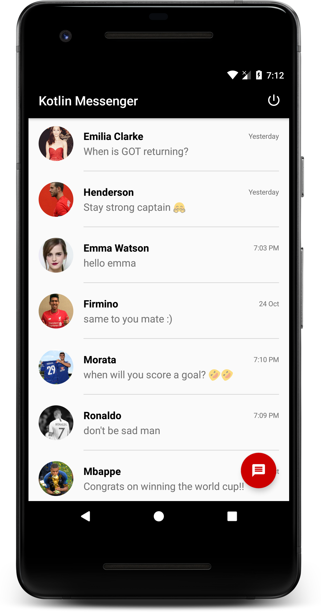
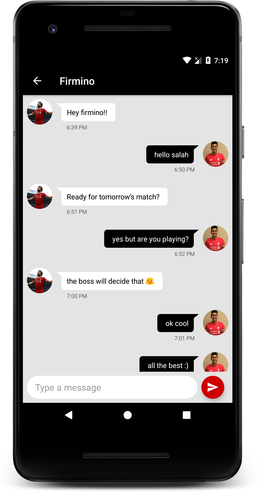
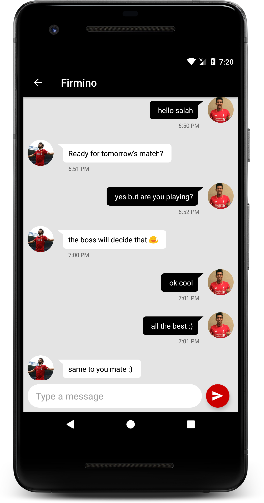
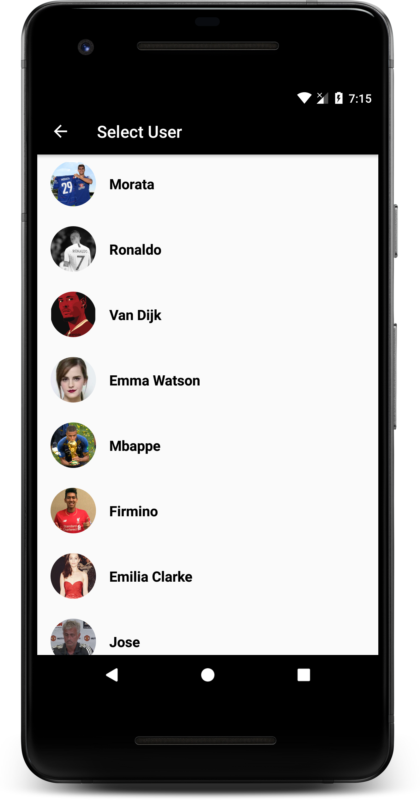
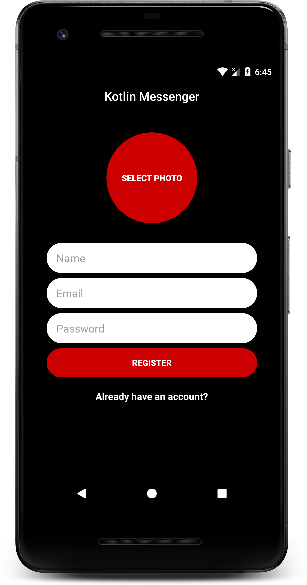
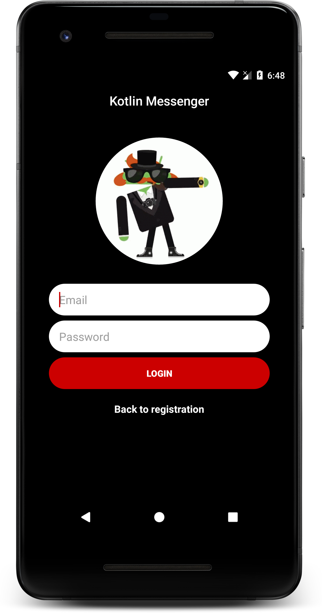

# Kotlin Messenger
A one-to-one chat app (similar to WhatsApp) built using Kotlin and Firebase.

## Screenshots

  
  
  
  
  
  

## Libraries used:
1. [Firebase Authentication](https://firebase.google.com/docs/auth/)
2. [Firebase Realtime Database](https://firebase.google.com/docs/database/)
3. [Firebase Cloud Storage](https://firebase.google.com/docs/storage/)
4. [Glide](https://github.com/bumptech/glide/)
5. [Groupie](https://github.com/lisawray/groupie)

## License

    Copyright 2018 Anshdeep Singh

    Licensed under the Apache License, Version 2.0 (the "License");
    you may not use this file except in compliance with the License.
    You may obtain a copy of the License at

        http://www.apache.org/licenses/LICENSE-2.0

    Unless required by applicable law or agreed to in writing, software
    distributed under the License is distributed on an "AS IS" BASIS,
    WITHOUT WARRANTIES OR CONDITIONS OF ANY KIND, either express or implied.
    See the License for the specific language governing permissions and
    limitations under the License.
